# Hectopolis store screenshots

Generated by the **screenshots** workflow — every image is a real render of
the real app, captured by `app/integration_test/screenshots_test.dart` on a
simulator or emulator. This branch is force-pushed by each run; do not commit
to it by hand.

| | |
|---|---|
| Source commit | `ea11d7f48cf41f5bb4dfdca521dd754c142c4b3d` (`main`) |
| Source run | [33994182486](https://github.com/CrispStrobe/stadtbau/actions/runs/33994182486) (attempt 1) |
| iOS job | `failure` |
| Android job | `success` |
| Captured | 2026-09-05 22:21 UTC |
| Images | 12 in 1 device directories |

## pixel_7_api34

`pixel_7_api34/` — 12 images

| stop | en | de |
|---|---|---|
| `01_levels` | <a href="pixel_7_api34/en_01_levels.png">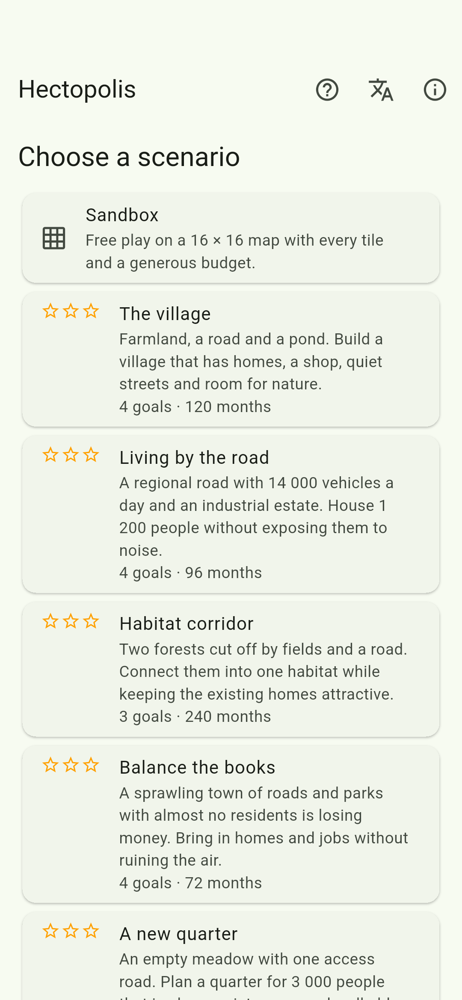</a> | <a href="pixel_7_api34/de_01_levels.png">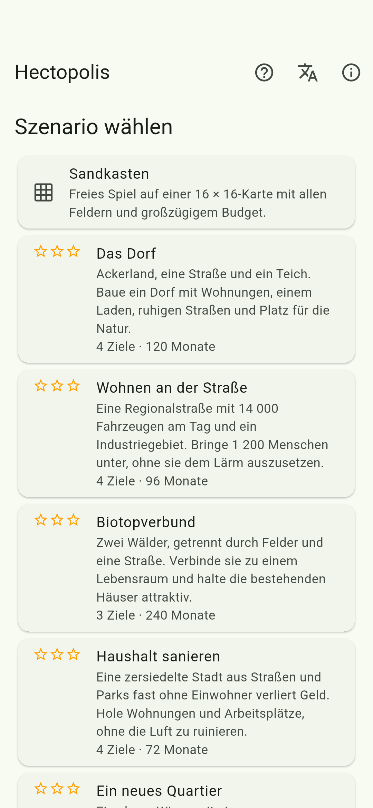</a> |
| `02_map` | <a href="pixel_7_api34/en_02_map.png">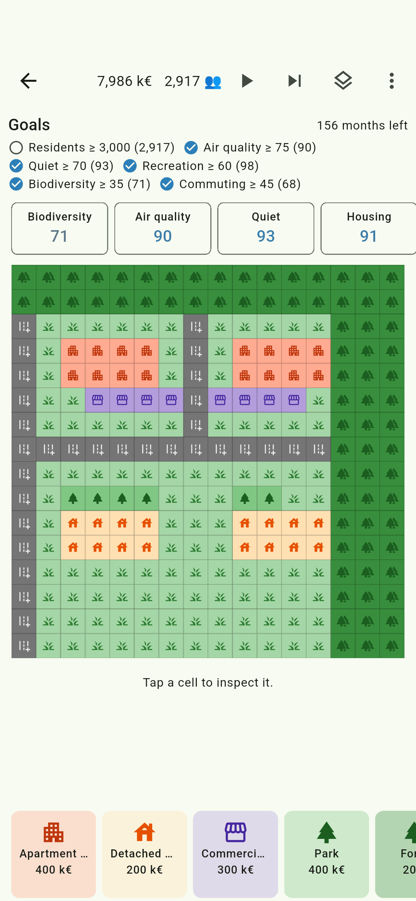</a> | <a href="pixel_7_api34/de_02_map.png">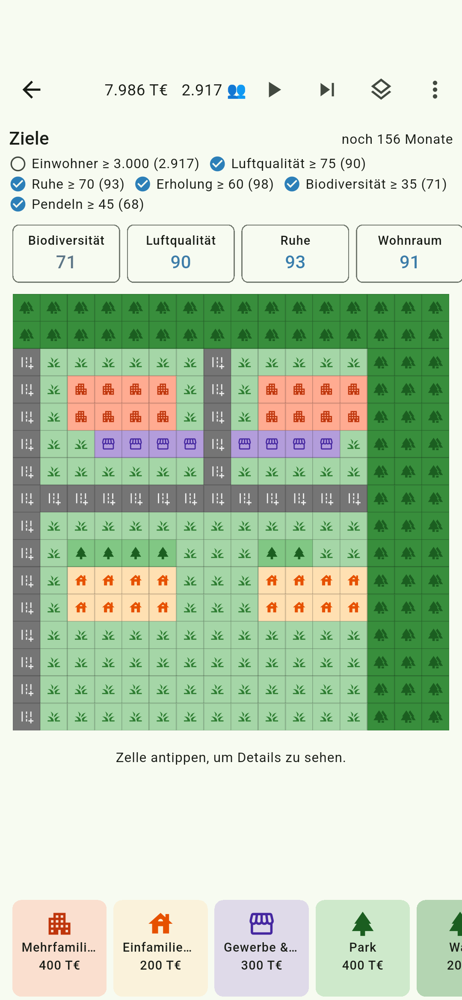</a> |
| `03_noise_overlay` | <a href="pixel_7_api34/en_03_noise_overlay.png">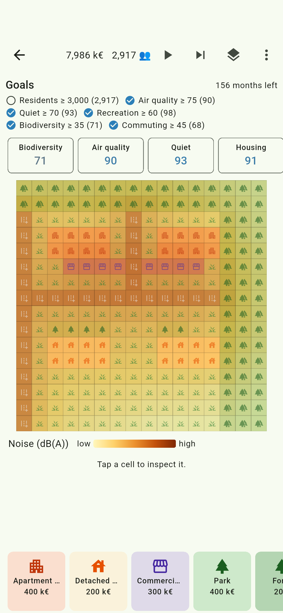</a> | <a href="pixel_7_api34/de_03_noise_overlay.png">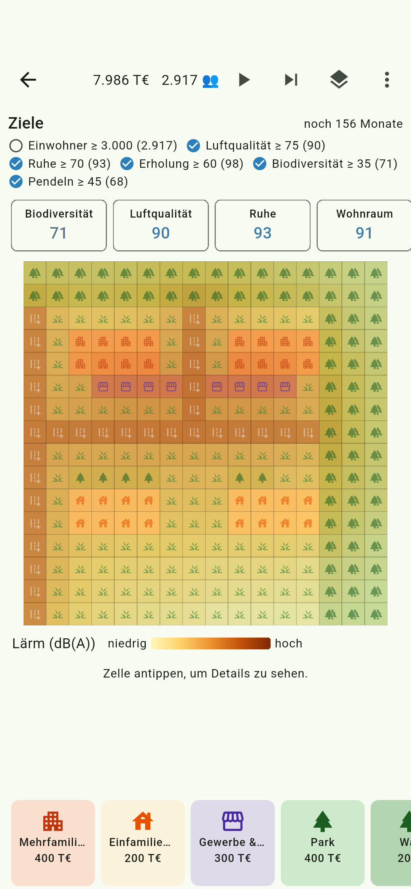</a> |
| `04_air_overlay` | <a href="pixel_7_api34/en_04_air_overlay.png">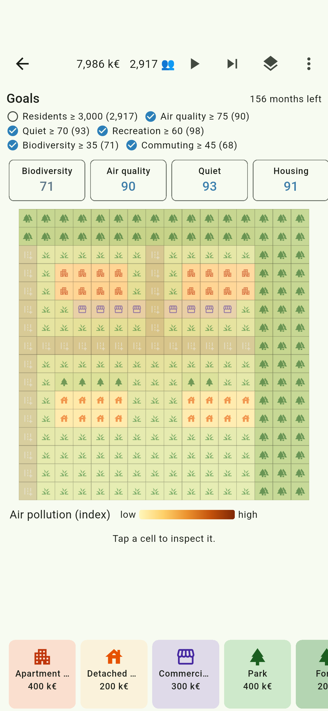</a> | <a href="pixel_7_api34/de_04_air_overlay.png">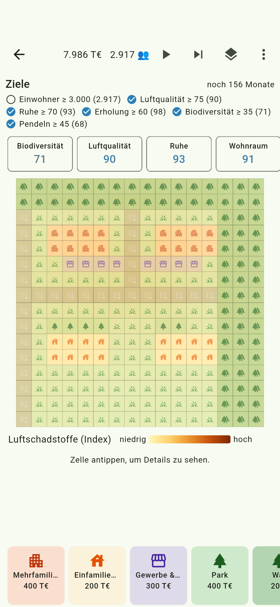</a> |
| `05_inspector` |  | <a href="pixel_7_api34/de_05_inspector.png">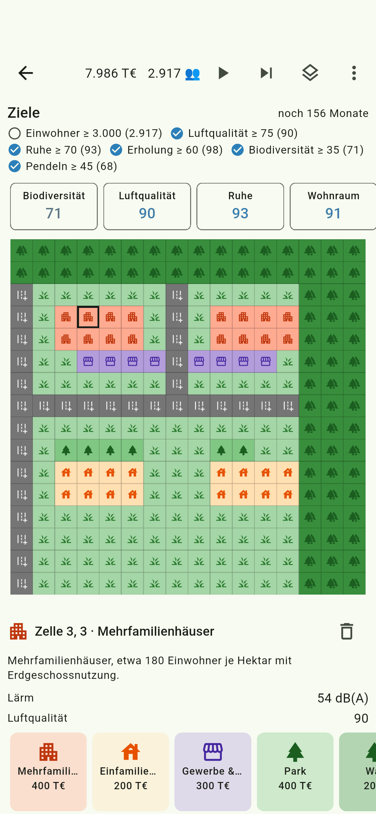</a> |
| `06_goals` | <a href="pixel_7_api34/en_06_goals.png">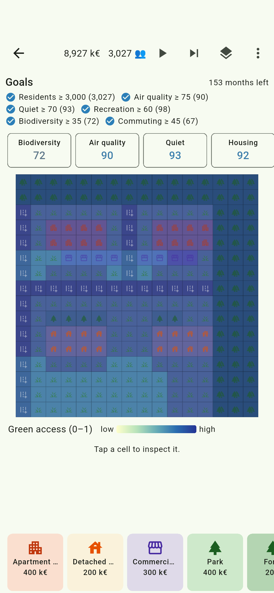</a> | <a href="pixel_7_api34/de_06_goals.png">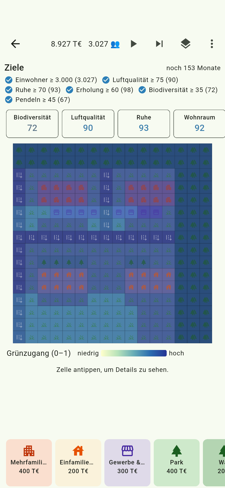</a> |

